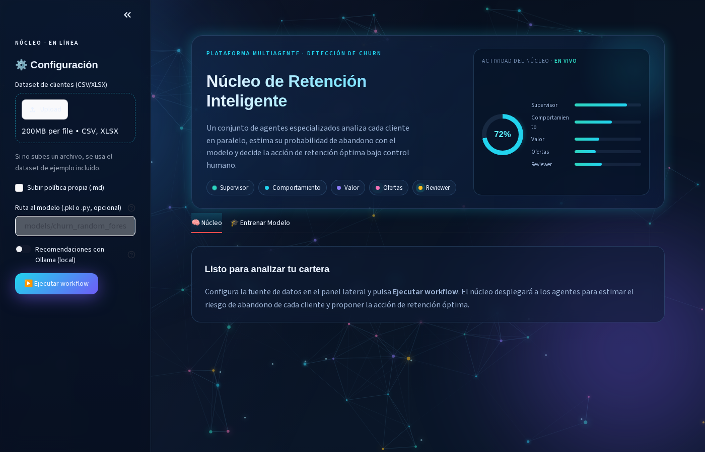
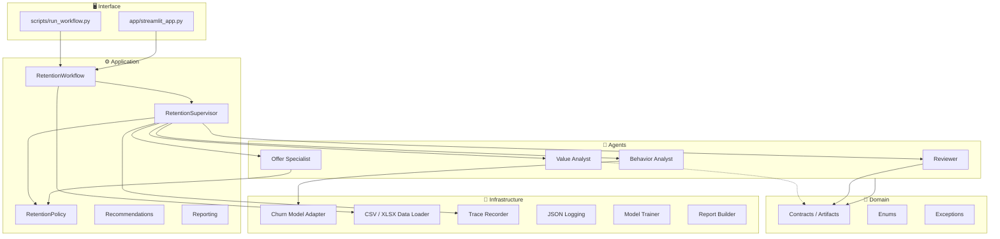
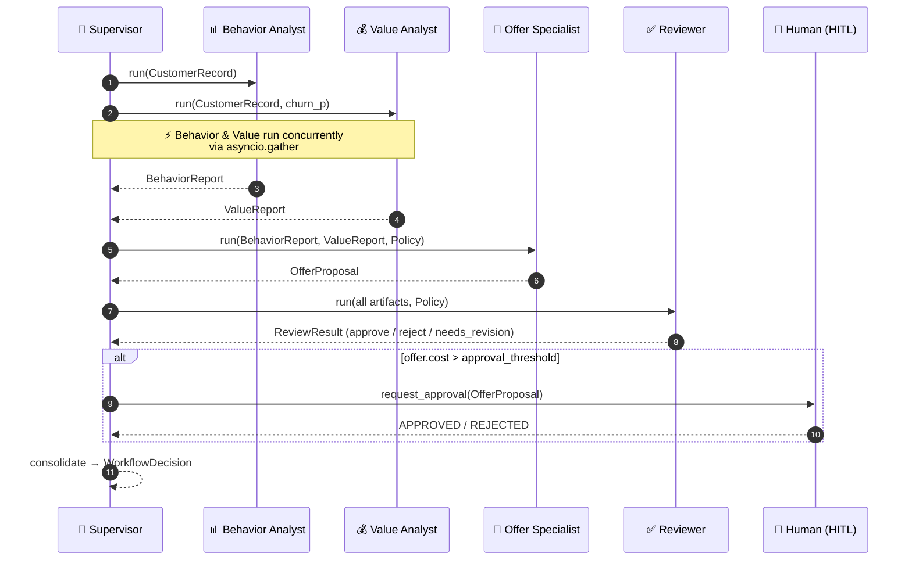
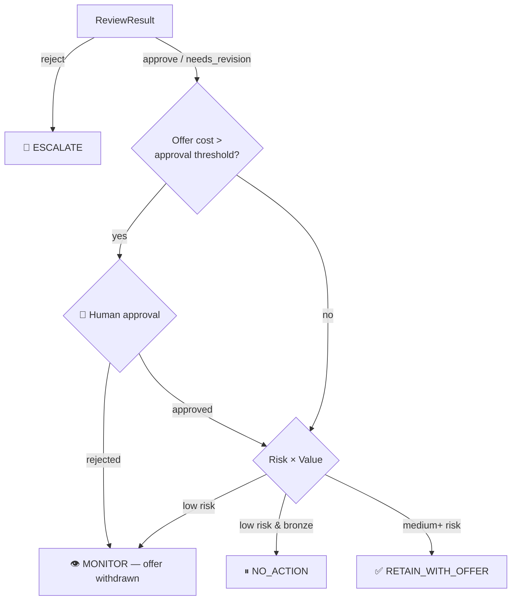

<p align="center">
  
</p>

<h1 align="center">Stay · Multi-Agent Customer Retention Engine</h1>

<p align="center">
  <em>Enterprise-grade churn prediction &amp; retention workflow powered by independent specialist agents, typed contracts, and human-in-the-loop authority.</em>
</p>

<p align="center">
  <a href="https://www.python.org/downloads/"></a>
  <a href="https://pydantic-docs.helpmanual.io/"></a>
  <a href="https://streamlit.io/"></a>
  <a href="https://www.docker.com/"></a>
  
  
  
  
</p>

<p align="center">
  <a href="#-quick-start">Quick Start</a> ·
  <a href="#-architecture">Architecture</a> ·
  <a href="#-multi-agent-execution">Multi-Agent Flow</a> ·
  <a href="#-web-dashboard">Dashboard</a> ·
  <a href="#-api-reference">API</a> ·
  <a href="#-contributing">Contributing</a>
</p>

---

## 📋 Table of Contents

- [Overview](#-overview)
- [Key Features](#-key-features)
- [Quick Start](#-quick-start)
- [Architecture](#-architecture)
- [Multi-Agent Execution](#-multi-agent-execution)
- [Decision Logic](#-decision-logic)
- [Artifact Contracts](#-artifact-contracts)
- [Web Dashboard](#-web-dashboard)
- [Synthetic Dataset](#-synthetic-dataset)
- [Quality & Testing](#-quality--testing)
- [Project Layout](#-project-layout)
- [Design Principles](#-design-principles)
- [Tech Stack](#-tech-stack)
- [Contributing](#-contributing)
- [License](#-license)

---

## 🔍 Overview

**Stay** is an enterprise multi-agent workflow for customer churn prediction and retention, built for the **MINE009** multi-agent seminar at **Universidad Externado de Colombia** — *Equipo 2: Abandono*.

It combines a **predictive churn model**, **deterministic business code**, four **independent specialist agents**, **typed contracts**, a **mandatory quality gate**, **bounded iteration**, **structured traceability**, and **human authority** (Human-in-the-Loop).

> **This is not a single LLM call simulating roles.** Every agent executes separately and communicates only through validated, immutable Pydantic artifacts — no shared memory, no hallucinated fields.

### What it does

Given a dataset of customers, for each customer the workflow:

1. **Predicts** the probability of churn with the base model
2. **Quantifies** the customer's economic value (CLV, cost of loss)
3. **Designs** a policy-compliant retention offer (cost, discount, ROI)
4. **Reviews** everything through a mandatory quality gate
5. **Requests human approval** when the offer cost exceeds the policy threshold
6. **Consolidates** a final, auditable retention decision

---

## ✨ Key Features

| Category | Details |
|:---|:---|
| **Multi-Agent Orchestration** | 5 independent agents (Supervisor + 4 specialists) with `asyncio.gather` parallelism |
| **Typed Contracts** | Immutable Pydantic v2 models with `frozen=True`, `extra="forbid"` — hallucinated fields rejected at construction |
| **Quality Gate** | Mandatory `Reviewer` agent validates every proposal; bounded re-delegation (max 1 retry) |
| **Human-in-the-Loop** | Automatic escalation for offers exceeding the cost threshold; human acts as auditor, not blocker |
| **Churn Prediction** | Random Forest / Gradient Boosting / Logistic Regression with AUC-ROC and cross-validation |
| **Interactive Dashboard** | Premium dark-themed Streamlit UI with animated neural-network background, glassmorphism, and real-time KPIs |
| **Export & Reporting** | JSON, PDF, and XLSX export of flagged offers for audit |
| **Dockerized** | Multi-service `compose.yml` — CLI, UI, and CI test runner with a single build |
| **Full Test Coverage** | 45 tests (unit / integration / contract), pylint 10/10, mypy strict, bandit clean |

---

## 🚀 Quick Start

### Prerequisites

- Python 3.11+
- pip (or Docker)

### Option A — Local Install

```bash
# Clone the repository
git clone https://github.com/<your-username>/Stay_MultiAgent.git
cd Stay_MultiAgent

# Install with UI dependencies
pip install -e ".[ui]"

# Generate the synthetic dataset (optional)
python scripts/generate_synthetic_dataset.py --rows 1000 --seed 42 \
    --out-dir data --formats csv xlsx

# Run the workflow
python scripts/run_workflow.py \
    --csv data/customers.csv \
    --policy src/customer_retention/resources/politica_retencion.md \
    --out report.json

# Launch the web dashboard
streamlit run app/streamlit_app.py
```

### Option B — Docker

```bash
docker compose build

# Score the dataset (CLI)
docker compose run --rm retention-workflow

# Launch the web dashboard → http://localhost:8501
docker compose up ui

# Run the test suite
docker compose --profile ci run --rm tests
```

### Option C — Make

```bash
make install-dev    # Install all dependencies
make data           # Generate synthetic dataset
make run            # Run the CLI workflow
make ui             # Launch the Streamlit dashboard
make test           # Run pytest with coverage
make lint           # Run all linters
```

---

## 🏗 Architecture

The project follows **Clean / Hexagonal Architecture** with strict dependency inversion — the domain knows nothing about infrastructure; agents depend on domain contracts and protocol ports, never on concrete implementations.



---

## 🔄 Multi-Agent Execution



If the Reviewer returns `needs_revision`, the Supervisor re-delegates the offer **once** (bounded iteration) before consolidating — preventing infinite loops.

---

## 🧠 Decision Logic

The final retention decision combines **risk level**, **customer value**, and **offer cost**:



---

## 📝 Artifact Contracts

All inter-agent communication happens through **immutable Pydantic models** with `extra="forbid"` — a hallucinated field is rejected at construction, and agents cannot mutate a received artifact.


---

## 🖥 Web Dashboard

**Núcleo de Retención Inteligente** — A premium dark-themed dashboard with animated neural-network canvas, glassmorphism cards, and real-time monitoring.

<p align="center">
  
</p>

```bash
# Local
streamlit run app/streamlit_app.py

# Docker
docker compose up ui    # → http://localhost:8501

# Make
make ui
```

### Dashboard Features

| Feature | Description |
|:---|:---|
| **Data Upload** | CSV / XLSX upload or bundled sample dataset + optional retention policy (`.md`) |
| **KPI Row** | Analyzed, at-risk, retained, offer spend, value protected |
| **Efficiency Gauge** | First-pass approval rate, mean latency, agent error count |
| **Recommendations** | Up to 5 qualitative churn-mitigation insights (rule-based or Ollama-powered) |
| **Priority Watch-list** | Top at-risk customers with risk badges |
| **Alert Report** | Offers exceeding policy threshold flagged as `FLAGGED_FOR_AUDIT` — exportable as JSON, PDF, or XLSX |
| **Model Training** | Train Random Forest / Gradient Boosting / Logistic Regression, view AUC-ROC + CV metrics, export `.pkl` |

---

## 🗃 Synthetic Dataset

The project runs with a bundled sample and a deterministic heuristic model — `pytest` and the demo work with **zero external files**. For realistic testing, a reproducible synthetic-data generator is included.

```bash
python scripts/generate_synthetic_dataset.py --rows 1000 --seed 42 \
    --out-dir data --formats csv xlsx
```

**Schema:** `customer_id`, `tenure`, `contract`, `monthly_charges`, `total_charges`, `num_products`, `support_calls`, `complaints`, `auto_pay`, `age`, `is_active`, `churn`

The `churn` column is the target and is **never leaked** into model features.

<details>
<summary><b>Typical output characteristics (seed 42, 1 000 rows)</b></summary>

| Metric | Value |
|:---|---:|
| Overall churn rate | ~27% |
| Month-to-month churn | 36% |
| One-year contract churn | 18% |
| Two-year contract churn | 13% |
| Churn by support calls | 17% → 47% (monotonic) |

Latent churn propensity is built from interpretable drivers (contract type, tenure, support pressure, complaints, auto-pay, products, activity) plus Gaussian noise, and the `churn` label is *sampled* — classes overlap intentionally and are not perfectly separable.

</details>

---

## ✅ Quality & Testing

<table>
<tr><td><b>Tool</b></td><td><b>Result</b></td></tr>
<tr><td>pytest</td><td></td></tr>
<tr><td>pylint</td><td></td></tr>
<tr><td>mypy</td><td></td></tr>
<tr><td>flake8</td><td></td></tr>
<tr><td>black / isort</td><td></td></tr>
<tr><td>bandit</td><td></td></tr>
</table>

```bash
# Run everything
make lint
make test

# Or individually
pytest
pylint src/customer_retention
mypy src/customer_retention
bandit -r src
black --check src scripts tests
```

---

## 📁 Project Layout

```
Stay_MultiAgent/
├── 📄 README.md
├── 📄 INSTALL.md                         # Detailed installation guide
├── 📄 pyproject.toml                     # PEP 621 project metadata
├── 📄 Makefile                           # Task runner (install, test, lint, ui)
├── 📄 Dockerfile                         # Multi-stage build (python:3.11-slim)
├── 📄 compose.yml                        # CLI · UI · CI test services
├── 📄 manifest.json                      # Architecture manifest (agents, contracts)
├── 📄 .pre-commit-config.yaml            # Git hooks (black, isort, flake8)
│
├── 📂 app/
│   └── streamlit_app.py                  # Interactive web dashboard (Streamlit)
│
├── 📂 scripts/
│   ├── run_workflow.py                   # CLI entry point
│   ├── generate_synthetic_dataset.py     # Reproducible test-data generator
│   └── demo.py                           # Quick demonstration script
│
├── 📂 data/
│   ├── customers.csv                     # Generated dataset
│   └── customers.xlsx                    # Generated dataset (Excel)
│
├── 📂 models/
│   └── churn_random_forest.pkl           # Pre-trained model
│
├── 📂 src/customer_retention/
│   ├── 📂 domain/                        # Contracts, enums, exceptions (pure)
│   │   ├── contracts.py                  # Pydantic artifacts (frozen, strict)
│   │   ├── enums.py                      # RiskLevel, DecisionAction, ...
│   │   └── exceptions.py                 # Domain-specific errors
│   ├── 📂 application/                   # Workflow, supervisor, policy
│   │   ├── workflow.py                   # RetentionWorkflow orchestrator
│   │   ├── supervisor.py                 # RetentionSupervisor (delegation)
│   │   ├── policy.py                     # RetentionPolicy rules
│   │   ├── recommendations.py            # Rule-based + Ollama engine
│   │   └── reporting.py                  # Portfolio-level analytics
│   ├── 📂 agents/                        # 4 independent agents + base
│   │   ├── base.py                       # Abstract agent protocol
│   │   ├── behavior_analyst.py           # Churn probability + risk signals
│   │   ├── value_analyst.py              # CLV + cost of loss
│   │   ├── offer_specialist.py           # Retention offer design
│   │   └── reviewer.py                   # Quality gate (approve/reject)
│   ├── 📂 infrastructure/                # Adapters & I/O
│   │   ├── model_adapter.py              # ChurnModelPort implementation
│   │   ├── model_trainer.py              # Scikit-learn training pipeline
│   │   ├── data_loader.py                # CSV / XLSX ingestion
│   │   ├── report_builder.py             # PDF / XLSX report generation
│   │   ├── tracing.py                    # Per-agent trace recorder
│   │   └── logging_config.py             # Structured JSON logging
│   ├── 📂 prompts/                       # Per-agent prompt specifications
│   ├── 📂 tools/                         # CLV math, HITL gateway
│   └── 📂 resources/                     # Sample dataset + default policy
│
├── 📂 skills/
│   └── customer-retention-workflow/
│       └── SKILL.md                      # Plugin skill definition
│
├── 📂 tests/
│   ├── conftest.py                       # Shared fixtures
│   ├── 📂 unit/                          # 11 unit test modules
│   ├── 📂 integration/                   # End-to-end workflow tests
│   └── 📂 contract/                      # Pydantic contract validation
│
└── 📂 docs/
    └── dashboard_preview.png             # Dashboard screenshot
```

---

## 🎯 Design Principles

| Principle | Application |
|:---|:---|
| **SOLID** | Single-responsibility agents; dependency inversion via `Protocol` ports (`ChurnModelPort`, `ApprovalGateway`) |
| **Clean / Hexagonal** | Domain is pure; infrastructure is swappable; dependency rule points inward |
| **DRY / KISS / YAGNI** | Shared helpers, deterministic tools, no speculative abstraction |
| **Robustness** | Graceful degradation to heuristic model; bounded iteration (max 1 re-delegation); mandatory quality gate |
| **Human Authority** | The LLM never has total control — human approval required for high-cost decisions |
| **Traceability** | Every agent execution produces a typed `AgentTrace`; full audit trail in structured JSON |
| **Immutability** | All contracts are `frozen=True` with `extra="forbid"` — no shared mutable state between agents |

---

## 🛠 Tech Stack

| Layer | Technology |
|:---|:---|
| **Language** | Python 3.11+ |
| **Contracts** | Pydantic v2 (frozen, strict) |
| **ML** | scikit-learn, joblib, numpy, pandas |
| **UI** | Streamlit 1.33+, Plotly 5.20+ |
| **Reports** | ReportLab (PDF), openpyxl (XLSX) |
| **Container** | Docker (python:3.11-slim), Docker Compose |
| **Quality** | pytest, pylint, mypy (strict), flake8, black, isort, bandit, radon |
| **Hooks** | pre-commit (black + isort + flake8) |

---

## 🤝 Contributing

1. Fork the repository
2. Create your feature branch (`git checkout -b feature/amazing-feature`)
3. Install dev dependencies (`pip install -e ".[dev]"`)
4. Make your changes
5. Run the quality suite (`make lint && make test`)
6. Commit your changes (`git commit -m 'feat: add amazing feature'`)
7. Push to the branch (`git push origin feature/amazing-feature`)
8. Open a Pull Request

---

## 📄 License

Distributed under the **MIT License**. See `pyproject.toml` for details.

---

<p align="center">
  Built with ❤️ by <b>Equipo 2 — Abandono</b><br/>
  <em>MINE009 · Seminario de Modelos Multiagentes · Universidad Externado de Colombia</em>
</p>
