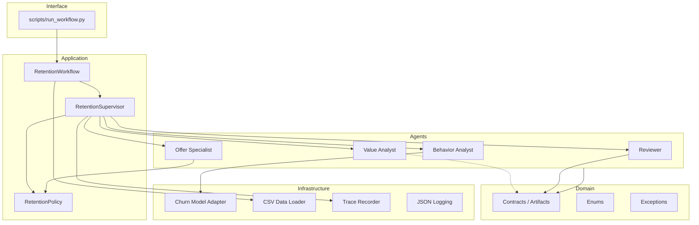
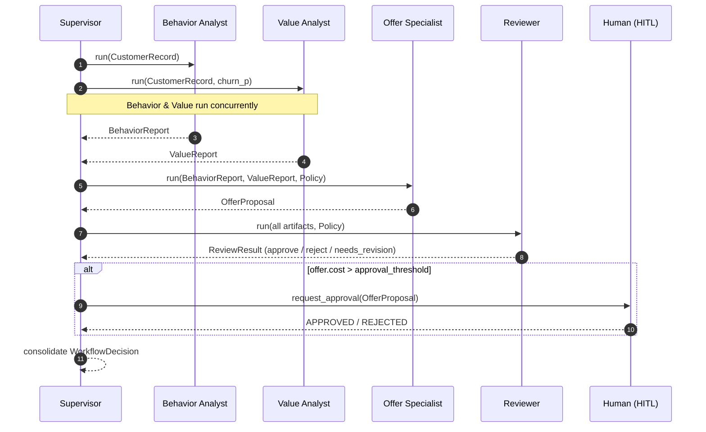
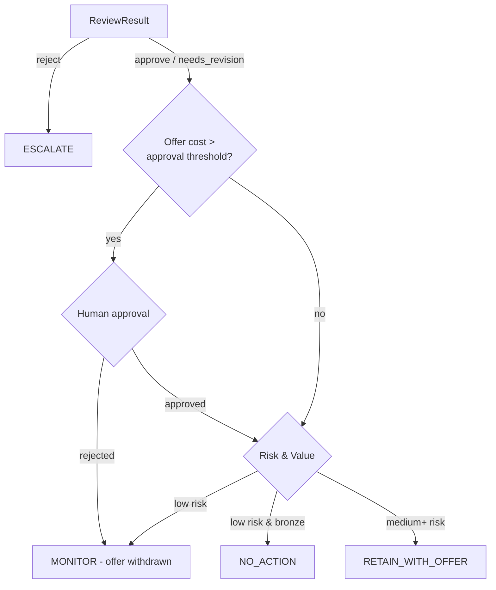
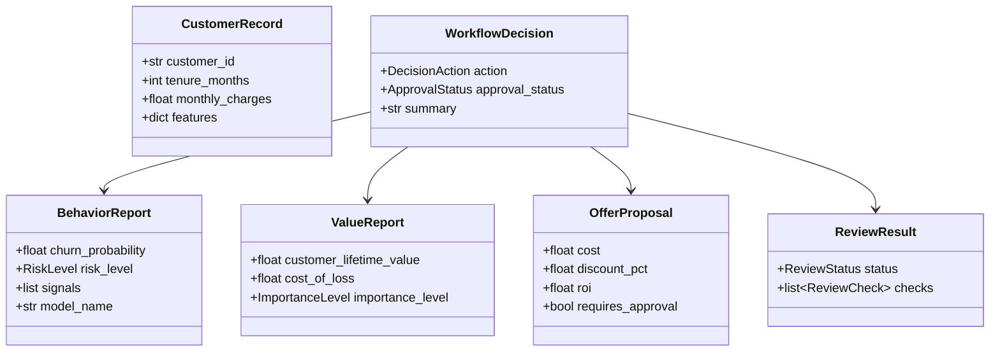
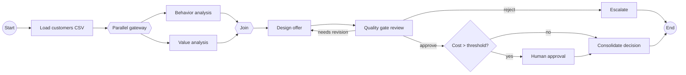

# customer-retention-workflow

**Enterprise multi-agent workflow for customer churn (abandono) prediction and
retention.** Built for the MINE009 (Externado) multi-agent seminar — *Equipo 2:
Abandono*.

It combines a **predictive churn model**, **deterministic business code**, four
**independent specialist agents**, **typed contracts**, a **mandatory quality
gate**, **bounded iteration**, **structured traceability** and **human
authority** (Human-in-the-Loop). It is *not* a single LLM call simulating
roles — every agent executes separately and communicates only through validated
artifacts.

---

## 1. What it does

Given a dataset of customers, for each customer the workflow:

1. Predicts the **probability of churn** with the base model.
2. Quantifies the customer's **economic value** (CLV, cost of loss).
3. Designs a **policy-compliant retention offer** (cost, discount, ROI).
4. Passes everything through a **Reviewer quality gate**.
5. Requests **human approval** when the offer cost exceeds the policy threshold.
6. Consolidates a final, auditable **retention decision**.

---

## 2. Architecture (Clean / Hexagonal layering)



The dependency rule points inward: **domain** knows nothing about
infrastructure; **agents** depend on domain contracts and infrastructure
*ports* (protocols), never on concrete files.

---

## 3. Multi-agent execution flow



If the Reviewer returns `needs_revision`, the Supervisor re-delegates the offer
**once** (bounded iteration) before consolidating.

---

## 4. Decision logic (risk + value + cost)



---

## 5. Artifact contracts (class diagram)



All artifacts are **immutable Pydantic models** with `extra="forbid"` — a
hallucinated field is rejected at construction, and agents cannot mutate a
received artifact (no shared memory).

---

## 6. BPMN-simplified workflow



---

## 7. Install & run

```bash
# from the plugin root
pip install ".[dev]"

# run over the challenge dataset
python scripts/run_workflow.py \
  --csv    challenges/session7/churn/customers.csv \
  --policy challenges/session7/churn/politica_retencion.md \
  --model  challenges/session7/model_base.py \
  --out    report.json

# interactive Human-in-the-Loop approvals
python scripts/run_workflow.py --interactive
```

### Docker

```bash
docker compose build
docker compose run --rm retention-workflow          # scores the dataset (CLI)
docker compose up ui                                # launches the web UI
docker compose --profile ci run --rm tests          # runs the test suite
```

---

## 7-bis. Interactive web UI (Streamlit) — Núcleo de Retención Inteligente

Premium dark-themed dashboard (animated neural background, glassmorphism
cards) layered on the same engine. **Operating model: the nucleus processes
100% of the portfolio automatically; the human acts as an auditor, never as
a blocking gate.**

```bash
pip install ".[ui]"
streamlit run app/streamlit_app.py     # or: make ui / docker compose up ui
```

Features:

- Upload `customers.csv` / `.xlsx` (or use the bundled sample) + optional
  policy `.md` + optional model source (`.pkl` trained in-app or `model_base.py`).
- **KPI row**: analysed, at-risk (alerted), retained, offer spend, value
  protected.
- **Efficiency gauge (velocímetro)** replacing per-customer trace listings:
  first-pass approval rate, mean latency, agent error count.
- **Recommendations panel**: up to 5 qualitative churn-mitigation bullets.
  Rule-based engine by default; optional local **Ollama** connector (e.g.
  `qwen2.5`) with automatic fallback to rules if the server is unreachable.
- **Retention priority watch-list**: top at-risk customers with risk badges.
- **Alert report button**: offers exceeding the policy threshold are flagged
  (`FLAGGED_FOR_AUDIT`) — not blocked — and exported on demand as
  **JSON, PDF or XLSX** for human audit.
- **Entrenar Modelo tab**: train Random Forest / Gradient Boosting /
  Logistic Regression, view AUC-ROC + CV metrics, export the `.pkl`.

---

## 7-ter. Synthetic dataset for testing

The project already runs with a small bundled sample and a deterministic
heuristic model, so `pytest` and the demo work with **zero external files**. For
realistic testing, a reproducible synthetic-data generator is included.

```bash
python scripts/generate_synthetic_dataset.py --rows 1000 --seed 42 \
    --out-dir data --formats csv xlsx
```

It writes `data/customers.csv` and `data/customers.xlsx` (the loader reads
both). The data is intentionally **realistic, not over-acted**: a latent churn
propensity is built from interpretable drivers (contract type, tenure, support
pressure, complaints, auto-pay, products, activity) plus Gaussian noise, and the
`churn` label is *sampled* — so classes overlap and are not perfectly separable.

Schema: `customer_id, tenure, contract, monthly_charges, total_charges,
num_products, support_calls, complaints, auto_pay, age, is_active, churn`.
The `churn` column is the target and is **never leaked** into the model features.

Typical output (seed 42, 1000 rows): ~27% churn rate; churn by contract
month-to-month 36% > one-year 18% > two-year 13%; churn rises monotonically with
support calls (17% → 47%).

Run the full workflow over it:

```bash
python scripts/run_workflow.py --csv data/customers.xlsx \
    --policy src/customer_retention/resources/politica_retencion.md \
    --out report.json
```

---

## 8. Quality

| Tool     | Result |
|----------|--------|
| pytest   | **45 passed** |
| pylint   | **10.00 / 10** |
| mypy     | strict, **0 errors** |
| flake8   | clean |
| black / isort | formatted |
| bandit   | no issues |
| streamlit UI | flake8 / pylint 10 / mypy strict clean |

Run everything:

```bash
black --check src scripts tests
isort --check-only src scripts tests
flake8 src scripts tests
pylint src/customer_retention
mypy src/customer_retention
bandit -r src
pytest
```

---

## 9. Project layout

```
customer-retention-workflow/
├── .codex-plugin/plugin.json        # plugin manifest (codex convention)
├── manifest.json                    # architecture manifest
├── skills/customer-retention-workflow/SKILL.md
├── app/streamlit_app.py             # interactive web UI (Streamlit)
├── scripts/run_workflow.py          # CLI entry point
├── scripts/generate_synthetic_dataset.py  # reproducible test-data generator
├── data/                            # generated customers.csv / customers.xlsx
├── src/customer_retention/
│   ├── domain/                      # contracts, enums, exceptions (pure)
│   ├── application/                 # workflow, supervisor, policy, reporting
│   ├── agents/                      # 4 independent agents + base
│   ├── infrastructure/              # model adapter, data loader, logging, tracing
│   ├── prompts/                     # per-agent prompt specs
│   ├── tools/                       # CLV math, human-in-the-loop gateways
│   └── resources/                   # sample dataset + policy (demo/tests)
├── tests/                           # unit / integration / contract
├── Dockerfile, compose.yml, .env.example
└── pyproject.toml, .pylintrc, setup.cfg, .pre-commit-config.yaml
```

---

## 10. Design principles applied

- **SOLID** — single-responsibility agents; dependency inversion via `Protocol`
  ports (`ChurnModelPort`, `ApprovalGateway`).
- **Clean / Hexagonal** — domain is pure; infrastructure is swappable.
- **DRY / KISS / YAGNI** — shared helpers, deterministic tools, no speculative
  abstraction.
- **Robustness** — graceful degradation to a heuristic model; bounded iteration;
  mandatory quality gate; the LLM never has total control.
